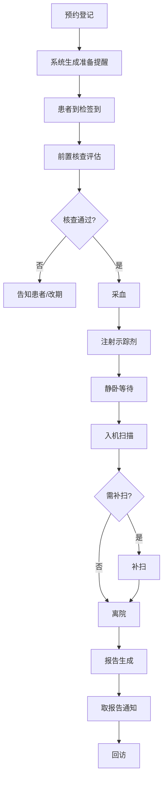

## 1. 产品概述

核医学科检查流程管理台是面向医院核医学科的专业工作流协同系统，串联"预约—评估—注射—候检—扫描—报告—回访"全链路，支持科主任、登记护士、PET-CT 技师三类角色协作。

- 核心价值：实现检查全流程可追踪、号源资源精细化管理、患者分流与重点人群关怀、运营数据可视化决策
- 目标用户：核医学科主任、登记护士、PET-CT 技师

## 2. 核心功能

### 2.1 用户角色

| 角色 | 核心权限 |
|------|----------|
| 科主任 | 全局视图、运营统计、号源配置、特殊审批 |
| 登记护士 | 预约登记、到检评估、前置核查、改约取消、患者签到 |
| PET-CT 技师 | 注射记录、候检管理、扫描调度、设备状态维护 |

### 2.2 功能模块

1. **预约排程页**：日历视图、号源管理、患者预约、改约取消、空档补位
2. **到检评估页**：患者签到、前置核查（禁食/血糖/妊娠/增强史）、重点人群标记、采血确认
3. **当日看板页**：全流程节点状态追踪（签到→采血→注射→静卧→入机→补扫→离院）
4. **注射与候检页**：示踪剂批次记录、注射时间、等待时长、异常事件、静卧区管理
5. **报告衔接页**：影像医师工作列表、报告进度、取报告时间自动生成
6. **运营统计页**：爽约率、平均候检时长、设备利用率、高峰拥堵时段

### 2.3 页面详情

| 页面名称 | 模块名称 | 功能描述 |
|-----------|-------------|---------------------|
| 预约排程 | 号源配置 | 设置检查号源数量、放射性药物时段、设备时间窗、特殊检查类型 |
| 预约排程 | 预约列表 | 按日期显示已预约患者，支持门诊/住院/急诊分流筛选 |
| 预约排程 | 新建预约 | 录入患者信息、选择检查类型、时间段，标记糖尿病/儿童/行动不便等 |
| 预约排程 | 改约取消 | 支持迟到改约、取消释放号源、空档自动标记补位 |
| 到检评估 | 签到登记 | 患者到检签到，自动核对预约信息 |
| 到检评估 | 前置核查 | 禁食时长、血糖值、妊娠哺乳史、近期增强检查等核查项 |
| 到检评估 | 人群标记 | 糖尿病、儿童、行动不便、过敏史等重点人群标记 |
| 当日看板 | 流程节点 | 签到、采血、注射、静卧、入机、补扫、离院状态实时显示 |
| 当日看板 | 设备状态 | PET-CT 设备运行状态、当前扫描患者、预计完成时间 |
| 当日看板 | 预警提醒 | 超时候检、异常事件、重点患者高亮提醒 |
| 注射与候检 | 示踪剂管理 | 批次号、活度、注射时间、注射人员记录 |
| 注射与候检 | 静卧管理 | 静卧区床位占用、等待时长计时、异常事件记录 |
| 报告衔接 | 工作列表 | 待报告、报告中、已报告的影像列表 |
| 报告衔接 | 取报告提醒 | 自动计算并生成取报告时间通知 |
| 运营统计 | 核心指标 | 爽约率、平均候检时长、设备利用率、日/周检查量 |
| 运营统计 | 时段分析 | 高峰拥堵时段热力图、检查类型分布 |
| 运营统计 | 趋势分析 | 月度/季度趋势图表、科室运营 KPI |

## 3. 核心流程

患者从预约到完成检查的完整流程：预约登记→系统生成准备提醒→患者到检签到→前置核查评估→采血→注射示踪剂→静卧等待→入机扫描→补扫（如需）→离院→报告生成→取报告通知→回访。

## 4. 用户界面设计

### 4.1 设计风格
- **主色调**：深海蓝 (#0C4A6E) + 青色 (#0891B2) 作为医疗专业感主色系
- **辅助色**：琥珀橙 (#F59E0B) 用于预警提醒，翡翠绿 (#10B981) 用于完成状态，玫红 (#E11D48) 用于紧急状态
- **中性色**：石板灰系列 (#0F172A ~ #F8FAFC) 构建信息层次
- **按钮风格**：圆角 6px，微妙阴影，悬停上浮动效
- **字体**：Noto Sans SC 中文显示字体 + JetBrains Mono 数据等宽字体
- **布局风格**：左侧导航栏 + 顶部状态栏 + 主内容区的经典工作台布局，卡片式信息模块化
- **图标风格**：Lucide 线性图标，统一 20px 尺寸

### 4.2 页面设计概览

| 页面名称 | 模块名称 | UI 元素 |
|-----------|-------------|----------|
| 预约排程 | 日历视图 | 周/日切换日历，时间轴 30 分钟粒度，号源卡片状态色标 |
| 预约排程 | 号源配置 | 侧边抽屉表单，时段滑块，检查类型标签 |
| 到检评估 | 核查清单 | 分组卡片，开关/数值/单选组合输入，提交后状态变绿 |
| 当日看板 | 流程追踪 | 横向泳道式时间线，节点圆形状态徽章，患者卡片可拖动 |
| 当日看板 | 设备面板 | 大号设备状态指示器，倒计时进度条 |
| 注射与候检 | 注射记录 | 表单式录入，时间自动填充，批次下拉选择 |
| 注射与候检 | 静卧区 | 平面床位布局图，占用状态颜色区分，等待时长计时 |
| 报告衔接 | 工作列表 | 表格视图，行内状态标签，优先级排序 |
| 运营统计 | 指标卡片 | 大号数据 + 趋势小图表，环比变化百分比 |
| 运营统计 | 图表区 | 多 Tab 切换：折线图/柱状图/热力图 |

### 4.3 响应式
- 桌面端优先设计（1440px 基准），适配科室工作站大屏显示
- 关键数据看板支持 1920px 宽屏扩展
- 侧边导航在 1024px 以下折叠为图标模式
