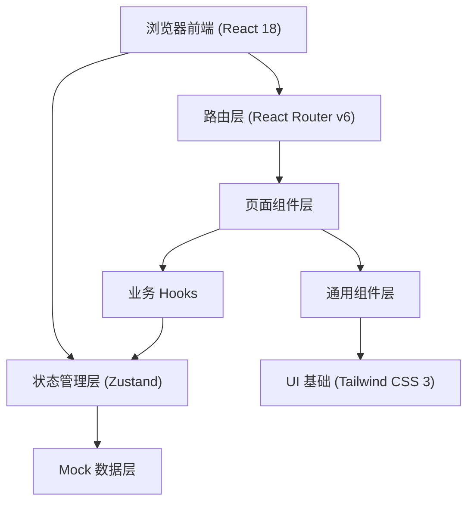

## 1. 架构设计

## 2. 技术描述
- **前端**：React@18 + TypeScript@5 + Vite@5 + tailwindcss@3
- **路由**：react-router-dom@6
- **状态管理**：zustand@4
- **图标库**：lucide-react
- **图表库**：recharts
- **后端**：无后端，使用 Mock 数据模拟
- **初始化工具**：vite-init（react-ts 模板）

## 3. 路由定义

| 路由 | 页面 | 说明 |
|------|------|------|
| /appointment | 预约排程页 | 号源管理、患者预约、改约取消 |
| /assessment | 到检评估页 | 签到、前置核查、人群标记 |
| /dashboard | 当日看板页 | 流程节点状态、设备状态、预警 |
| /injection | 注射与候检页 | 示踪剂记录、静卧管理、异常事件 |
| /report | 报告衔接页 | 工作列表、取报告提醒 |
| /statistics | 运营统计页 | KPI 指标、图表分析 |
| / | 重定向到 /dashboard | 默认进入当日看板 |

## 4. 数据模型

### 4.1 数据模型定义

```mermaid
erDiagram
    PATIENT {
        string id PK
        string name
        string gender
        int age
        string patientNo
        string patientType "门诊/住院/急诊"
        string[] tags "糖尿病/儿童/行动不便等"
        string phone
        string department
        string doctor
    }
    APPOINTMENT {
        string id PK
        string patientId FK
        string examType
        string examSubtype
        string date
        string timeSlot
        string status "待签到/已签到/进行中/已完成/已取消/爽约"
        string sourceNo
        string tracerBatch
        datetime createdAt
    }
    CHECKLIST {
        string id PK
        string appointmentId FK
        int fastingHours
        float bloodGlucose
        boolean isPregnant
        boolean isLactating
        string recentContrastExam
        string allergies
        string notes
        boolean passed
    }
    FLOW_NODE {
        string id PK
        string appointmentId FK
        string nodeType "签到/采血/注射/静卧/入机/补扫/离院"
        datetime startTime
        datetime endTime
        string operator
        string status
        string remark
    }
    INJECTION_RECORD {
        string id PK
        string appointmentId FK
        string tracerType
        string tracerBatch
        float tracerActivity
        datetime injectTime
        string injector
        string injectionSite
        string adverseReaction
    }
    DEVICE {
        string id PK
        string name
        string model
        string status "运行中/维护中/故障"
        string currentAppointmentId
        int utilizationToday
    }
    REPORT {
        string id PK
        string appointmentId FK
        string radiologist
        string status "待报告/报告中/已审核/已发布"
        datetime reportTime
        datetime pickupTime
        string urgency "普通/加急"
    }
```

### 4.2 Mock 数据结构
- 每个数据实体对应独立的 mock 数据文件，位于 `src/mock/` 目录
- 使用 TypeScript 类型定义约束数据结构
- 包含 20-30 条模拟数据，覆盖各类状态和场景
